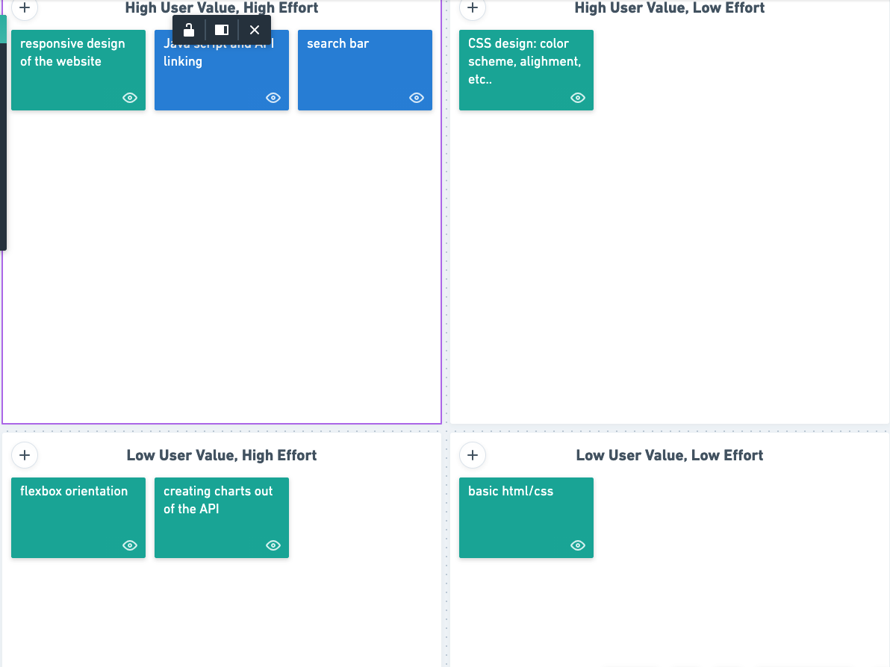
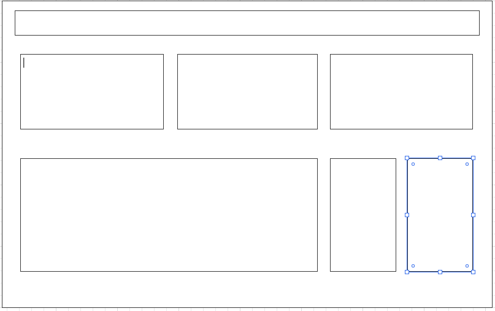

# Stock-Market-Game

## App Description
1. The app will keep live information about the stock market. You will be able to compare different stocks to one another. You will also be able to look at the top winners and top losers of the day. You can search to find any stock you will like. After choosing a stock it will allow you to get company information, a qoute of the stock, show there logo, and give you their earnings report. I will also have another area on the website that will allow the same thing for crypto currency. Looking into APIs that will be able to give me stock articles that will populate information about the current stock you researched and have a page about latest stock information. 

## API being used 
1. https://iexcloud.io

### API Get Request
1.https://cloud.iexapis.com/stable/stock/AAPL/book/2?period=annual&token=pk_3595f2a3dcd54938aa399641bb54ceed

### MVP
1. Search bar that will allow you to look up any stock or crypto currency
2. top gainers of the day top losers of the day 
3. stock watcher. for any stocks you own. 
4. up to date information. 

## Post MVP
1. build a stock market game where you will be able to invest money into different stocks. make it so the game is based on the live outcome of the stock but the game is much shorter then an actually day (so a day equals 4 minutes based on what the stocks are doing at that moment.)
2. add another api where we can add an article page. and articles pertaining to the stock you are looking up. 
3. integrating the graphs 
4. Comparison charts of two stocks/ crypto

### Priority Matrix

### Wire Frames

### Time Frames

| Task | Expected Time | Actual Time |
| ---- | ------------- | ----------- |
| HTML | 2 hrs         | xxx         |
| CSS  | 3 hrs        | xxx         |
| API  | 4 hrs        | xxx         |
| Search Bar  | 2 hrs        | xxx   |
| javaScript  | 5 hrs        | xxx         |

​
